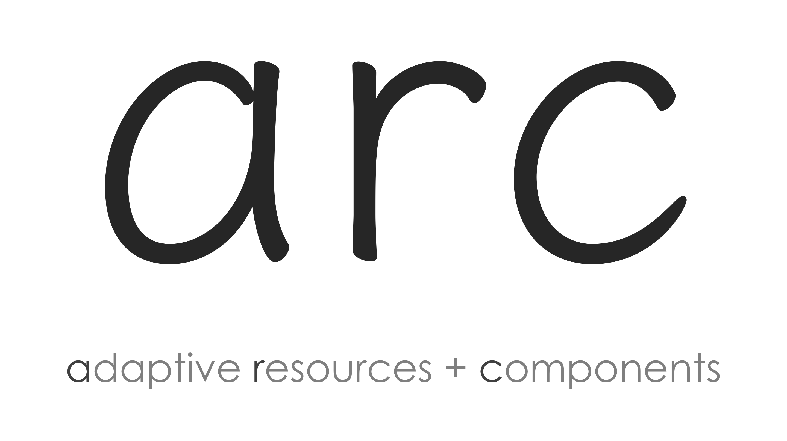

<p align="center">
   

   <br/>

   <a href="https://www.ebay.com">
      
   </a>
   <a href="https://img.shields.io/github/license/eBay/arc.svg">
      
   </a>
   <a href="https://travis-ci.org/eBay/arc">
      
   </a>
   <a href="https://codecov.io/gh/eBay/arc">
     
   </a>
   <a href="https://www.npmjs.com/package/arc-resolver">
      
   </a>
   <a href="http://npm-stat.com/charts.html?package=arc-resolver">
      
   </a>
</p>

---

`arc` uses “flags” and a file naming convention to generate and serve a bundle that contains only the resources used by the requesting environment. This allows building web applications that serve only the code necessary for multiple device types, locales, brands - _all from a single codebase_.

The flexibility of `arc` enables diverging components only when necessary. It works for both client + server and is not bound to any specific framework.

## How it works

`arc` adapts files based on a filenaming convension:

```webidl
style.css
style[mobile].css
style[mobile+android].css
```

However, you write your application as though the flagged version of files did not exist:

```css
@import url('./style.css');
```

If both the `mobile` and `android` flags are set, when bundling the css, `style[mobile+android].css` will replace `style.css` in the output bundle. If only the `mobile` flag is set, `style[mobile].css` will be used.

### More on flags

- Read how to set flags in the documentation for each [supported environment](#supported-environments).

- Read more about defining [flags in filenames](./packages/arc-resolver/README.md#defining-flags).

## Use cases

### Multiple platforms

For example, swap out a header component based on the user's device type:

```webidl
header[mobile].js
header[desktop].js
```

Then, in your React component:

```jsx
import Header from "./header.js";

export default () => (
   <Header/>
);
```

### Internationalization (i18n)

For example, swap out a content bundle based on the user's locale:

```webidl
content[de].json
content[en].json
content[es].json
content[fr].json
```

Then, in your Marko component:

```marko
import content from "./content.json";

<h1>${content.welcomeMessage}</h1>
```

### Branding

For example, swap out a logo based on the brand the user is visiting:

```webidl
logo[ebay].svg
logo[gumtree].svg
logo[vivanuncious].svg
```

Then, in your `.html` file:

```html

```

### Experimentation

For example, swap out a component based on the user's participation in an experiment:

```webidl
date-picker/
   date-picker.component.css
   date-picker.component.html
   date-picker.component.ts
date-picker[date_experiment_a]/
   date-picker.component.css
   date-picker.component.html
   date-picker.component.ts
```

Then, in your Angular module:

```ts
import { NgModule } from '@angular/core';
import { DatePickerComponent } from './date-picker/date-picker.component';

@NgModule({
  declarations: [
    DatePickerComponent
  ]
})
export class MyModule { }
```

## Supported environments

Please refer to the linked documentation for using `arc` in each environment:

- Node 8+ ([`arc-server`](./packages/arc-server))
- Webpack 4+ ([`arc-webpack`](./packages/arc-webpack))
- Lasso 3+ ([`arc-lasso`](./packages/arc-lasso))

## Additional resources

### Connie & Michael on `arc 1.0` @ Fluent O'Reilly Conf 2017:

- [Session abstract](https://conferences.oreilly.com/fluent/fl-ca/public/schedule/detail/58976)    
- [Recorded video](https://vimeo.com/229162833/c2727d5436)

### Example apps

- [Simple Server](./packages/example-arc-server)
- [Isomorphic Koa + Marko + Webpack]() TODO
- [Isomorphic Express + Marko + Lasso]() TODO
- [Isomorphic Express + React + Webpack]() TODO
- [Client-only React + Webpack + `arc-static-server`]() TODO
